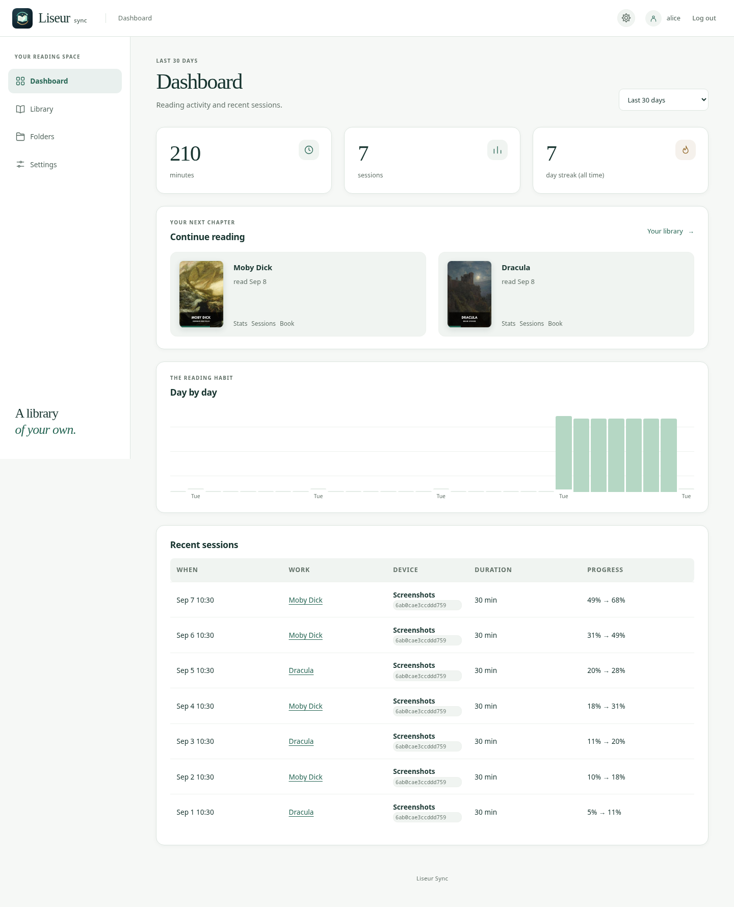
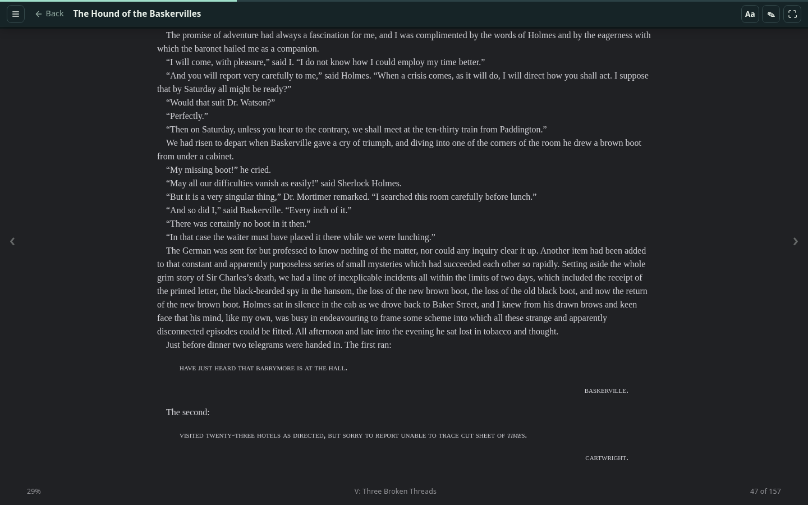
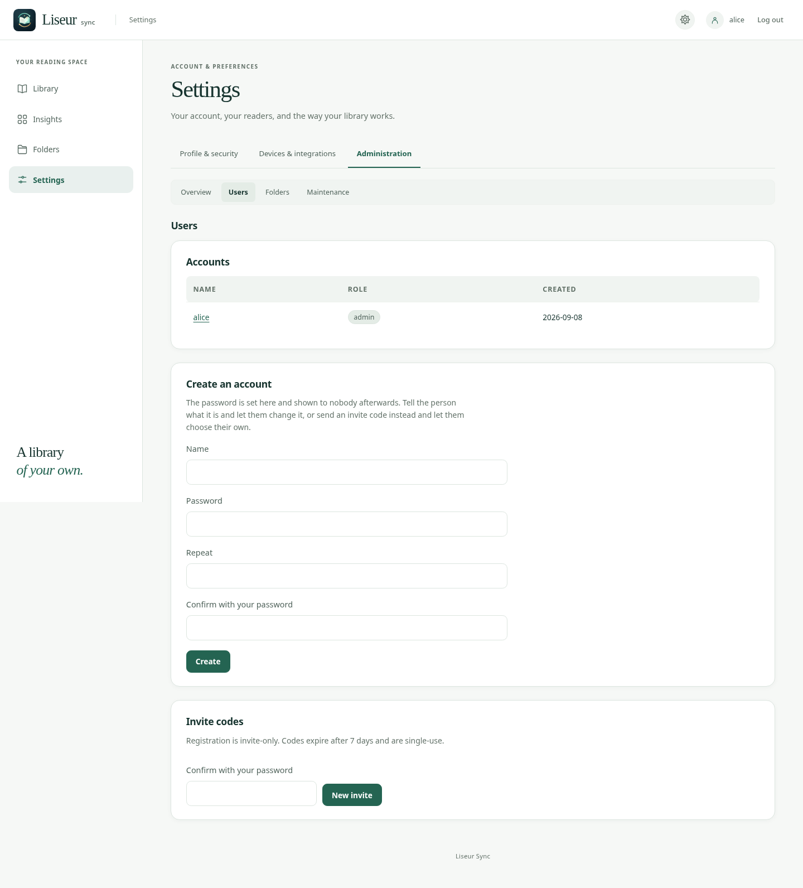

# liseur-sync

A self-hosted synchronization server for your books and reading
progress.

Companion server to
[Liseur](https://github.com/chmouel/liseur), with support for stock
KOReader through a kosync-compatible API.

`liseur-sync` ships as a single Go binary. SQLite by default, PostgreSQL
optional, multi-user.




## Why liseur-sync

Neither Komga nor calibre-web covers everything a personal ebook library
needs from a single server:

- **Komga** has excellent position sync (full Readium locators) and a
  clean REST API, but it cannot accept book uploads from a client — its
  design is filesystem-first, so books must be placed in library folders
  by other means. It cannot delete books remotely either. And it is a
  JVM application (~600 MB on disk), heavy for a Raspberry Pi or a small
  VPS.

- **calibre-web** can delete books and has a rich web UI, but its
  position sync only carries percentages (Kobo protocol), not exact
  reading positions. Its upload and delete routes are web-UI form posts
  behind browser sessions and CSRF tokens — not a proper API, fragile to
  scrape, and liable to break across versions.

- Neither server syncs books that never came from its own catalog (a
  book opened from a file manager, for example), and neither offers
  personal series claims or an append-only sync log that makes conflict
  resolution deterministic.

liseur-sync was built to be the one server that does all of it:
full-locator position sync (including for books it has never seen, via
hash-based resolution), proper file upload and delete through a real
REST API, personal series claims, and a lightweight footprint (~30 MB on
a Raspberry Pi). A single binary covers catalog, download, upload,
delete, position sync, and series management.

| Capability         | Komga            | calibre-web       | liseur-sync      |
|--------------------|------------------|-------------------|------------------|
| Catalog and search | REST API         | OPDS              | REST API + OPDS  |
| File download      | REST API         | OPDS              | REST API         |
| Position sync      | Full locators    | Percentages only  | Full locators    |
| Book upload        | Not possible     | Web UI form only  | REST API         |
| Book delete        | Not possible     | Web UI form only  | REST API         |
| Series management  | Read-only        | None              | Personal claims  |
| Footprint          | ~600 MB (JVM)    | ~200 MB (Python)  | ~30 MB (Go)      |

## Features

### Reading progress sync

`liseur-sync` keeps a per-user history of reading positions reported by
every device.

Every position update is recorded, not just the latest. A stale device
cannot overwrite newer progress, and the full history feeds reading
sessions and statistics.

Books are matched by content, not filename. Renaming, moving, or
re-encoding an EPUB does not necessarily lose the reading position.

### Watched folders and OPDS

Point `liseur-sync` at a directory of EPUBs or at a Calibre library. The
server watches it, reads metadata, and serves the books through the web
UI, the native catalog API, and OPDS 1.2.

A folder is read-only unless you say otherwise. Books stay where they
are; the server never modifies, renames, or deletes anything below the
folder root. A folder an administrator marks as accepting uploads can
have books *added* to it (a new file, or a new Calibre entry) and
nothing else, from the library page or from an app with the
`library-upload` scope. The only other files the server creates are
rendered covers in its cache directory.

```
liseur-sync admin folder-uploads <folder-id> on
```

Browse by series, contributor, or tag, and search across the collection.
In a plain folder, the directory tree is the organisation: a
subdirectory of EPUBs is a series. In a Calibre library, `metadata.db`
is read as the curator's catalog.


## Web reader



`liseur-sync` includes a browser-based EPUB reader.

Books unpack and render in the browser without exposing publisher
content through application routes. Scripts inside EPUBs do not run.

Progress syncs through the same API other clients use. Move between the
web reader, Liseur, KOReader, and other apps without losing your place.

See [ADR-0007](docs/adr/0007-web-reader.md) for the design and security
model, including the optional separate hostname for the reader.

## Quick start

The installer detects Docker or configures rootless Podman with a
systemd user service, then lets you pick a database, starts the server,
and creates the first account.

```sh
curl -fsSL https://raw.githubusercontent.com/chmouel/liseur-sync/main/scripts/install.sh | bash
```

If you prefer not to pipe a remote script directly into a shell, clone
the repository and run:

```sh
scripts/install.sh
```

You can install a specific release with:

```sh
LISEUR_VERSION=vX.Y.Z scripts/install.sh
```

### Docker Compose

Pick a database profile:

```sh
docker compose --profile sqlite up -d        # SQLite
docker compose --profile postgres up -d      # bundled PostgreSQL
docker compose --profile external up -d      # existing PostgreSQL server
```

### Build from source

```sh
go build ./cmd/liseur-sync
./liseur-sync serve
```

Once the server is running, open `/ui/`.

If no accounts exist yet, the setup page is displayed automatically. The
first account created becomes the initial administrator.

Add a folder from Settings → Administration → Folders, or from a shell:

```sh
liseur-sync admin add-folder Shelf /srv/books
```

Manage users, folders, API tokens, and reader pairing from the Settings
hub or the `admin` CLI.



See [docs/deployment.md](docs/deployment.md) for KOReader pairing, TLS,
watched folders, Calibre integration, and backups.

## Client integration

[Liseur](https://github.com/chmouel/liseur) is the reference client.

If you are building another client,
[docs/integrating.md](docs/integrating.md) covers the synchronization
model and protocol.

Full API spec: [docs/openapi.yaml](docs/openapi.yaml).

## Security

See [SECURITY.md](SECURITY.md) for reporting security issues.

Please do not report security vulnerabilities through public GitHub
issues.

## License

MIT.

The screenshots use public-domain editions from [Standard
Ebooks](https://standardebooks.org) and are generated by
`scripts/screenshots.sh`.
